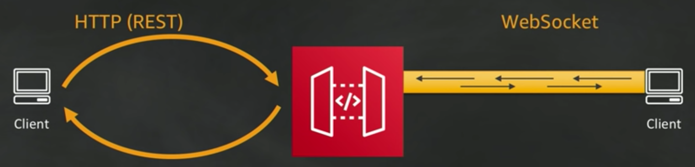
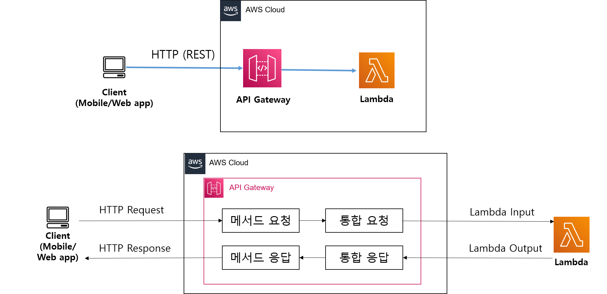
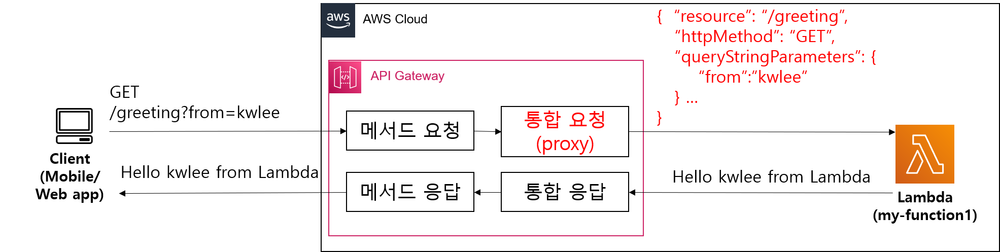
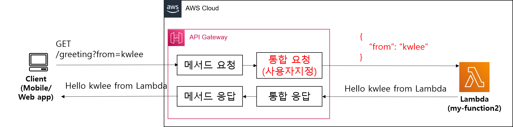
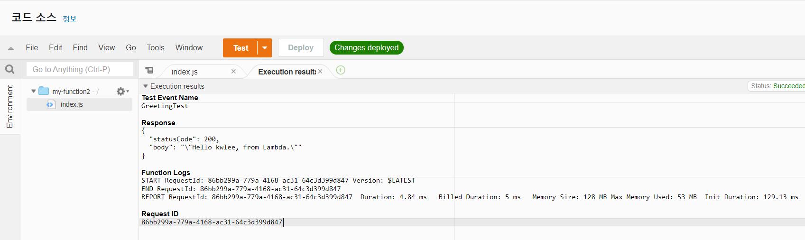
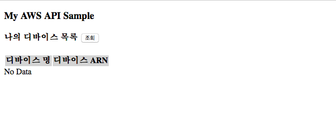
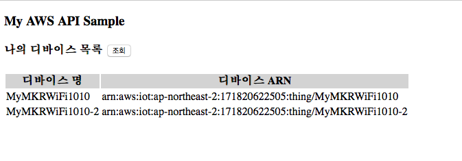

# API Gateway를 통한 Device Shadow 액세스 하기

##  학습내용
<<<<<<< HEAD
1. [디바이스 목록 조회 REST API 구축하기](listDevicesApi.md)
2. [디바이스 상태  조회 REST API 구축하기](getDeviceApi.md)
3. [디바이스 상태  변경 REST API 구축하기](updateDeviceApi.md)
4. [디바이스 로그 조회 REST API 구축하기](getLogApi.md)
=======
- [API Gateway](#1)
- [REST API 설계](#2)
- [API Gateway를 통한 Device Shadow 액세스 하기](#3)

---
<a name="1"></a>
## 1. API Gateway란?
- **API Gateway**는 개발자가 손쉽게 **API**를 생성, 게시, 유지관리, 모니터링할 수 있게 해주는 [완전 관리형 서비스](https://galid1.tistory.com/228)입니다.
	- API Gateway는 트래픽 관리, 권한 부여 및 액세스 제어, 모니터링 및 API 버전 관리 등 최대 수십만 개의 동시 API 호출을 수신 및 처리하는 데 관계된 모든 작업을 처리합니다.
- **API Gateway**을 이용하여 할 수 있는 일은?
	- API 개발자는 AWS 또는 다른 웹 서비스뿐 아니라 AWS 클라우드에 저장된 데이터에 액세스하는 API를 생성할 수 있습니다.
	- API 개발자는 자체 클라이언트 애플리케이션(앱)에서 사용할 API를 만들 수 있습니다. 또는 타사 앱 개발자가 API를 사용하도록 제공할 수도 있습니다.
	- 앱 개발자는 API Gateway에서 API 개발자가 생성한 API를 호출하여 AWS 서비스를 호출하기에 효과적인 애플리케이션을 구축합니다.

	
- **API Gateway**을 통해 만들 수 있는 API 종류

	
	- **REST API**
		- **상태가 없는** 클라이언트-서버 통신을 지원하는 **REST 프로토콜 준수**
		- 짧은 기간의 통신
		- HTTP 메소드 (Get, Post, Put, Delete, 등)
	- **WebSocket API**
		- 클라이언트와 서버 간에 **상태를 저장**하는 전이중 통신을 지원하는 **WebSocket 프로토콜 준수**
		- 긴 기간의 통신
		- 양방향 통신 채널

### 1.1Amazon API Gateway에서 Lambda 통합으로 REST API 생성
- Amazon API Gateway에서  Lambda와 통합으로 REST API를 생성하는 방법에 대해서 좀더 자세히 알아 보겠습니다.
	 
	- **REST API**는 HTTP Request 형식으로 표현됩니다. 자세한 내용은 다음 장에서 설명 
	-  **API Gateway REST API**에서 클라이언트는 **메서드 요청** 및 **메서드 응답**으로 캡슐되고, **API**는 **integration requests(통합 요청)** 및 **integration responses(통합 응답)**을 이용해 백엔드와 통신합니다.
		- 예를 들어 Lambda가 백엔드일 때, API 개발자는 수신되는 메서드 요청을 선택한 백엔드로 전달하도록 **통합 요청**을 설정합니다. 이 설정에는 적절한 Lambda 작업에 필요한 IAM 역할 및 정책, 필요한 입력 데이터 변환이 포함됩니다. 백엔드는 API Gateway에 **통합 응답**으로서 결과를 반환합니다.
- **Lambda 통합**을 사용하여 **REST API**를 구축하는 방법은 **Lambda 프록시 통합** 또는 **Lambda 비 프록시 (사용자 지정) 통합**이 있습니다.
	- **Lambda 프록시 통합**에서는 통합 Lambda 함수에 대한 입력을 HTTP Request 형식(요청 헤더, 경로 변수, 쿼리 문자열 파라미터 및 본문의 조합)으로 표현합니다. 
		- API 개발자의 경우 지정된 리전에서 특정 Lambda 함수를 선택하는 것만으로, Lambda 프록시 통합을 간단하게 설정할 수 있습니다. 
		- 설정을 완료하면 통합 API 메서드는 기존 설정을 수정하지 않고 백엔드와 함께 진화할 수 있습니다. 백엔드 Lambda 함수 개발자가 수신되는 요청 데이터를 구문 분석하고 아무런 문제가 없을 때 원하는 결과와 함께 클라이언트에 응답하거나 무언가 문제가 있을 때 오류 메시지와 함께 응답하기 때문입니다.
		
		
	- **Lambda 비 프록시 (사용자 지정) 통합**에서는 클라이언트가 제공하는 HTTP Request를 Lambda 함수가 인식하는 형식으로 변환합니다.
		

### [실습] Lambda 통합 API Gateway REST API 생성
- [1 단계: Lambda 콘솔에서 Lambda 함수 생성](#1.1)
- [2 단계: API Gateway 콘솔에서 REST API 생성](#1.2)
- [3 단계: API Gateway 콘솔에서 REST API 배포](#1.3)
- [4 단계: Lambda 콘솔에서 두번째 Lambda 함수 생성](#1.4)
- [5 단계: API Gateway 콘솔에서 REST API에 리소드, 메소드, 파라미터 추가](#1.5)

---
<a name="1.1"></a>
#### 1 단계: Lambda 콘솔에서 Lambda 함수 생성
Lambda 콘솔에서 [함수 페이지](https://console.aws.amazon.com/lambda/home#/functions)를 엽니다.

1. **함수 생성**을 선택합니다.
2. 기본 정보에서 다음과 같이 합니다.
	- [함수 이름(Function name)]에 *my-function1*을 입력합니다.
	- [런타임(Runtime)]에 Node.js 18.x가 선택되어 있는지 확인합니다. Lambda는 .NET(PowerShell, C#) Go, Java, Node.js, Python 및 Ruby용 런타임을 제공합니다.
3. **함수 생성**을 선택합니다.		
4.  **함수 코드** 창에 나온 코드를 다음 코드로 대체합니다.

	```javascript
	export const handler = async (event) => {
	    let name = event.queryStringParameters.from;
	    let greeing = `Hello ${name}, from Lambda.`;
	    const response = {
	        statusCode: 200,
	        body: JSON.stringify(greeting)
	    };
	    return response;
	};
	```			
5. **[Deploy]**를 선택합니다.	

---
<a name="1.2"></a>
#### 2 단계: API Gateway 콘솔에서 REST API 생성
https://console.aws.amazon.com/apigateway 에서 API Gateway 콘솔에 로그인합니다.

1. API Gateway를 처음 사용하는 경우, 서비스의 기능을 소개하는 페이지가 나타납니다. **REST API**에서 **구축** 선택합니다. **예제 API 생성** 팝업이 나타나면 **확인**을 선택합니다.
	- API Gateway를 처음 사용하는 것이 아닌 경우 **API 생성**을 선택합니다. **REST API**에서 [**구축**]를 선택합니다.
3. 다음과 같이 비어 있는 API를 생성합니다.
	- **REST API 생성**에서 **새 API**를 선택합니다.
	- 설정에서 다음과 같이 합니다.
		- **API 이름**에서 *LambdaApi*을(를) 입력합니다.
		- 필요한 경우 설명 필드에 설명을 입력합니다. 설명을 입력하지 않으려면 비워 둡니다.
		- 엔드포인트 유형(Endpoint Type) 설정을 지역(Regional)으로 그대로 둡니다.
	- **API 생성(Create API)**을 선택합니다.
4. 다음과 같이 **greeting** 리소스를 만듭니다.
	- **리소스** 트리에서 루트 리소스(**/**)를 선택하고, **리소스 생성**을 클릭합니다.
	- **리소스 이름**에 *greeting*을 입력합니다.
	- **오리진 간 리소스 공유(CORS)**를 선택 해제된 상태로 둡니다.
	- **Create Resource(리소스 생성)**을 클릭합니다.
5. **greeting** 리소스에 대한 GET 메소드를 설정합니다.
	- **리소스** 목록에서 /greeting을 선택합니다.
	- **메서드** 섹션에서 **메서드 생성**을 클릭합니다.
	- **메서드 유형**의 드롭다운 메뉴에서 **GET**을 선택합니다.
	- **통합 유형(Integration type)** 설정을 Lambda 함수(Lambda Function)로 유지합니다.
	- **Lambda 프록시 통합**을 활성화합니다.
	- **Lambda 함수** 에서 *my-function1* Lambda 함수를 생성한 리전을 선택하고, 드롭다운 메뉴에서  *my-function1* 을 선택합니다.
	- **Use Default Timeout(기본 제한 시간 사용)**이 선택된 상태이어야 합니다.
	- **메서드 생성**을 클릭합니다.
	
---
<a name="1.3"></a>
#### 3 단계: API Gateway 콘솔에서 REST API 배포
API Gateway 콘솔에서 API 배포

1. **API 배포**를 선택합니다.
2. 스테이지에서 [새 단계]([new stage])를 선택합니다.
3. 단계 이름에 *test*를 입력합니다.
4. 필요한 경우 단계 설명을 입력합니다.
5. 필요한 경우 배포 설명을 입력합니다.
6. **배포**를 클릭합니다.
7. API의 호출 URL을 클릭하여 테스트해본다.
	- 웹 브라우저의 주소창에 URL을 복사하고, 그 뒤의 패스에 */greeting?from=kwlee*을 덧붙인 후 엔터를 쳐본다. 
	- "Hello kwlee, from Lambda." 메시지가 브라우저 창에 출력되는지 확인해 본다.	
	
---
<a name="1.4"></a>
#### 4 단계: Lambda 콘솔에서 두번째 Lambda 함수 생성
Lambda 콘솔에서 [함수 페이지](https://console.aws.amazon.com/lambda/home#/functions)를 엽니다.

1. **함수 생성**을 선택합니다.
2. 기본 정보에서 다음과 같이 합니다.
	- [함수 이름(Function name)]에 *my-function2*을 입력합니다.
	- [런타임(Runtime)]에 Node.js 18.x가 선택되어 있는지 확인합니다. Lambda는 .NET(PowerShell, C#) Go, Java, Node.js, Python 및 Ruby용 런타임을 제공합니다.
3. **함수 생성**을 선택합니다.	
4. **함수 코드** 창에 나온 코드를 다음 코드로 대체합니다.

	```javascript
	export const handler = async (event) => {
	  let name = event.from;
	  let greeting = `Hello ${name}, from Lambda.`;
	  // TODO implement
	  const response = {
	    statusCode: 200,
	    body: JSON.stringify(greeting),
	  };
	  return response;
	};	
	```

5. **[Deploy]**를 클릭합니다.	
6. 새로 생성된 함수를  테스트하려면 **Test**을 선택하고 **Configure test event (테스트 이벤트 구성)**을 선택합니다.
	- 이벤트 이름에 *GreetingTest*를 입력하고 
	- 이벤트 JSON에서 아래와 같이 변경한 후, **저장**을 클릭합니다.	
		
		```
		{
	  		"from": "Kwanwoo"
	  	}
	  	```
7. **테스트**를 선택하여 함수를 호출합니다. 정상 수행되면 다음과 같은 출력이 표시됩니다.
	


---
<a name="1.5"></a>
#### 5 단계: API Gateway 콘솔에서 REST API에 리소드, 메소드, 파라미터 추가
https://console.aws.amazon.com/apigateway 에서 API Gateway 콘솔에 로그인합니다.

1. **API** 목록에서 * LambdaApi*를 선택합니다.
2. 다음과 같이 **greeting2** 리소스를 만듭니다.
	- **리소스** 트리에서 루트 리소스(**/**)를 선택하고, **리소스 생성**을 클릭합니다.
	- **리소스 이름**에 *greeting2*를 입력합니다.
	- **오리진 간 리소스 공유(CORS)**를 선택 해제된 상태로 둡니다.
	- **Create Resource(리소스 생성)**을 클릭합니다.
3. **greeting2** 리소스에 대한 GET 메소드를 설정합니다.
	- **리소스** 목록에서 /greeting2을 선택합니다.
	- **메서드** 섹션에서 **메서드 생성**을 클릭합니다.
	- **메서드 유형**의 드롭다운 메뉴에서 **GET**을 선택합니다.
	- 통합 유형(Integration type) 설정을 Lambda 함수(Lambda Function)로 유지합니다.
	- **Lambda 프록시 통합**을 선택 해제한 상태로 유지합니다.
	- **Lambda 함수** 에서 *my-function2* Lambda 함수를 생성한 리전을 선택하고, 드롭다운 메뉴에서  *my-function2* 을 선택합니다.
	- **Use Default Timeout(기본 제한 시간 사용)**이 선택된 상태이어야 합니다.
	- **메시드 생성**을 선택합니다.
4. **통합요청**을 선택하여, 클라이언트가 제공하는 HTTP Request를 Lambda 함수가 인식하는 형식으로 변환합니다.
	- 화면의 하단의 **템플릿 생성**을 클릭한다.
	- **콘텐츠 유형** 드롭다운 메뉴에서 *application/json*을 입력
	-  **탬플릿 생성** 드롭다운 메뉴에서 *메서드 요청 패스스루*를 선택하고, 템플릿 본문에 다음을 입력합니다.

		```
		{
		    "from": "$input.params('from')"
		}
		```
		
		이는 Lambda 함수(my-function2)에 전달될 JSON 문서 형식을 나타내는 것으로, **from** 속성의 값으로 입력 쿼리 문자열에서 이름이 "from"인 파라미터의 값을 지정한다는 의미입니다.
	- **탬플릿 생성**을 클릭합니다.
5. 마지막으로  API 배포를 진행합니다.
	- **스테이지** 드롭다운 메뉴에서 test를 선택하고, **배포**를 선택합니다.
6. API는 다음과 같이 테스트 합니다.
	- 웹 브라우저의 주소창에 URL을 복사하고, 그 뒤의 패스에 */greeting2?from=kwlee*을 덧붙인 후 엔터를 쳐본다. 
	- {"statusCode":200,"body":"\\"Hello kwlee, from Lambda.\\""} 메시지가 브라우저 창에 출력되는지 확인해 본다.
	
---
<a name="2"></a>
## 2. REST API 설계
- **REST API**는 웹 상의 어떤 자원에 대한 처리를 위해서 다음 3가지 구성요소로 정의된다.
	- **리소스 (Resource)**
		- 서버는 Unique한 ID를 가지는 리소스를 가지고 있으며, 클라이언트는 이러한 리소스에 요청을 보냅니다. 이러한 리소스는 URI에 해당합니다.
	- **메소드 (Method)**
		- 서버에 요청을 보내기 위한 방식으로 GET, POST, PUT, DELETE가 있습니다. CRUD 연산 중에서 처리를 위한 연산에 맞는 메소드를 사용하여 서버에 요청을 보내야 합니다.
	- **자원의 표현 (Representation of Resource)**
		- 클라이언트와 서버가 데이터를 주고받는 형태로 json, xml, text, rss 등이 있습니다. 최근에는 Key, Value를 활용하는 json을 주로 사용합니다.

-  **REST API 설계 기본 규칙**
	- 리소스는 동사보다는 명사를, 대문자보다는 소문자를 사용
	- 리소스의 도큐먼트 이름으로는 단수명사를 사용
	- 리소스의 컬렉션 이름으로 복수명사를 사용
	- 리소스에 대한 행위는 HTTP Method (GET, PUT, POST, DELETE)로 표현한다.

<a name="2.1"></a>
### 2.1 디바이스 목록 조회
- 요청

	```
	GET /devices
	```

- 응답모델

	```json
	{
		"things": [
		     {
		    	"thingName": "string",
		      	"thingArn": "string"
		     },
		     ...
		   ]
	}
	```
<a name="2.2"></a> 		
### 2,2 디바이스 상태 조회
- 요청

	```
	GET /devices/{deviceId}
	```

- 응답 모델
	- [GetThingShadow](https://docs.aws.amazon.com/ko_kr/iot/latest/developerguide/API_GetThingShadow.html)의 [응답 상태 문서](https://docs.aws.amazon.com/ko_kr/iot/latest/developerguide/device-shadow-document-syntax.html#device-shadow-example-response-json)

		```json
		{
		    "state": {
		        "desired": {
		            "attribute1": integer2,
		            "attribute2": "string2",
		            ...
		            "attributeN": boolean2
		        },
		        "reported": {
		            "attribute1": integer1,
		            "attribute2": "string1",
		            ...
		            "attributeN": boolean1
		        },
		        "delta": {
		            "attribute3": integerX,
		            "attribute5": "stringY"
		        }
		    },
		    "metadata": {
		        "desired": {
		            "attribute1": {
		                "timestamp": timestamp
		            },
		            "attribute2": {
		                "timestamp": timestamp
		            },
		            ...
		            "attributeN": {
		                "timestamp": timestamp
		            }
		        },
		        "reported": {
		            "attribute1": {
		                "timestamp": timestamp
		            },
		            "attribute2": {
		                "timestamp": timestamp
		            },
		            ...
		            "attributeN": {
		                "timestamp": timestamp
		            }
		        }
		    },
		    "timestamp": timestamp,
		    "clientToken": "token",
		    "version": version
		}
		```
<a name="2.3"></a> 				
### 2.3 디바이스 상태 변경
- 요청

	```		
	PUT /devices/{deviceID}
	```
	- body

		```json
		{
			"tags" : [
				{
					"attrName": "temperature",
					"attrValue": "27.0"
				},
				{
					"attrName": "LED",
					"attrValue": "OFF"
				}
			]
		}
		```		
- 응답모델
	- [UpdateThingShadow](https://docs.aws.amazon.com/ko_kr/iot/latest/developerguide/API_UpdateThingShadow.html)의 [응답 상태 문서](https://docs.aws.amazon.com/ko_kr/iot/latest/developerguide/device-shadow-document-syntax.html#device-shadow-example-response-json)

<a name="2.4"></a> 		
### 2.4 디바이스 로그 조회
- 요청

	```		
	GET /devices/{deviceId}/log?from=2019-11-20 11:12:10&to=2019-12-1 12:00:00
	```

- 응답모델

	```json
	{
		"data":[
			{
				"time":timestamp,
				"attribute1": integer3,
				"attribute2": "string3",
					...
			},
			...
		]
	}
	```

<!--
<a name="2.5"></a> 	
###2.5 디바이스 로그 활성화/비활성화
- 요청

	```		
	PUT /devices/{deviceId}/log?enabling=true
	```

- 응답모델

	```json
	{
		"logging": "enabled" [혹은 "disabled"]
	}
	```
-->

---
<a name="3"></a>
## 3. API Gateway를 통한 Device Shadow 액세스 하기
AWS IoT 플랫폼에서는 원하는 프로그래밍 언어를 기반으로 [AWS SDK](https://aws.amazon.com/ko/tools/)를 사용하여 디바이스 섀도에 액세스 할 수 있습니다. 이 장에서는 **Java용 AWS SDK**를 사용하여 Device Shadow를 액세스하는 **Lambda 함수**를 정의하고, 이 Lambda 함수를 **API Gateway**와 통합하여 2절에서 정의한 **REST API**를 구축하는 방법을 설명합니다.


<a name="3.1"></a>
### 3.1 [디바이스 목록 조회 REST API 구축하기](api-gateway-3.1.html)
다음과 같은 API 요청과 API 응답을 가지는 REST API를 Lambda 함수와 API Gateway를 이용하여 구축해본다.

- API 요청
	
	```	
	GET /devices
	```
	
- API 응답

	```json
	{
		"things": [ 
		     { 
		    	"thingName": "string",
		      	"thingArn": "string"
		     }, 
		     ...
		   ]
	}
	```

--
#### 단계1: AWS Toolkit을 통해 Lambda 함수 생성
1. 다음 정보를 바탕으로 AWS Lambda 프로젝트를 JetBrains용 AWS Toolkit을 이용하여 생성한다.
	- **Project name**: *ListingDeviceLambda*
	- **Rumtime**:*java11*
 	- **SDK**: 11버전의 SDK를 선택하거나 없으면 다운로드한 후 선택 
 	
	
2. 생성된 *ListingDeviceLambda*의 **build.gradle** 파일을 열고, 다음 의존성을 추가하고, **변경사항을 반영**합니다.

	```
	dependencies {
        ...
        implementation platform('com.amazonaws:aws-java-sdk-bom:1.12.529')
        implementation 'com.amazonaws:aws-java-sdk-iot'
        ...
    }
   	```

3. **src/main/java/helloworld/App.java** 파일을 다음 코드로 바꿉니다.
	
	```java
	package helloworld;
	import java.util.List;
	import com.amazonaws.services.iot.AWSIot;
	import com.amazonaws.services.iot.AWSIotClientBuilder;
	import com.amazonaws.services.iot.model.ListThingsRequest;
	import com.amazonaws.services.iot.model.ListThingsResult;
	import com.amazonaws.services.iot.model.ThingAttribute;
	import com.amazonaws.services.lambda.runtime.Context;
	import com.amazonaws.services.lambda.runtime.RequestHandler;
	import com.amazonaws.services.lambda.runtime.events.APIGatewayProxyResponseEvent;
	import java.util.Map;
	import java.util.HashMap;
	
	public class App implements RequestHandler<Object, APIGatewayProxyResponseEvent> {
	
	    @Override
	    public APIGatewayProxyResponseEvent handleRequest(Object input, Context context) {
	
	        // AWSIot 객체를 얻는다.
	        AWSIot iot = AWSIotClientBuilder.standard().build();
	
	        // ListThingsRequest 객체 설정.
	        ListThingsRequest listThingsRequest = new ListThingsRequest();
	
	        // listThings 메소드 호출하여 결과 얻음.
	        ListThingsResult result = iot.listThings(listThingsRequest);
	
	
	        Map<String, String> headers = new HashMap<>();
	        headers.put("Content-Type", "application/json");
	        headers.put("X-Custom-Header", "application/json");
	
	        APIGatewayProxyResponseEvent response = new APIGatewayProxyResponseEvent()
	                .withHeaders(headers);
	
	        // result 객체로부터 API 응답모델 문자열 생성하여 반
	        return response.withStatusCode(200).withBody(getResultStr(result));
	    }
	
	    /**
	     * ListThingsResult 객체인 result로 부터 ThingName과 ThingArn을 얻어서 Json문자 형식의
	     * 응답모델을 만들어 반환한다.
	     * {
	     * 	"things": [
	     *	     {
	     *			"thingName": "string",
	     *	      	"thingArn": "string"
	     *	     },
	     *		 ...
	     *	   ]
	     * }
	     */
	    private String getResultStr(ListThingsResult result) {
	        List<ThingAttribute> things = result.getThings();
	
	        String resultString = "{ \"things\": [";
	        for (int i =0; i<things.size(); i++) {
	            if (i!=0)
	                resultString +=",";
	            resultString += String.format("{\"thingName\":\"%s\", \"thingArn\":\"%s\"}",
	                    things.get(i).getThingName(),
	                    things.get(i).getThingArn());
	
	        }
	        resultString += "]}";
	        return resultString;
	    }
	
	}
	```
	
4. **src/test/java/helloworld/AppTest.java** 파일의 코드를 주석처리하여 컴파일 오류를 제거시킨다.

#### 단계2: Lambda 함수의 로컬 테스트

작성된 Lambda함수가 정상적으로 동작하는 지를 테스트해 보기 위해서 다음 절차를 수행합니다.

- [**필수**] Docker 프로세스가 실행된 상태이어야 함 
  
1. IntelliJ IDEA IDE의 화면 상단 타이틀 바에서 "[Local] HelloWorldFunction" 옆의 **연두색 실행 버튼 (삼각형)을 클릭**
  
2. [**Edit Configuration**] 다이얼로그 화면에서 **Text -- Event Templates --** 부분의 드롭다운 메뉴 중에서 *API Gateway AWS Proxy*를 선택 
  
  - **Run** 클릭
    

3. **Console** 창에 다음과 같은 형식의 메시지가 마지막에 출력되는 지 확인합니다. (본인의 aws 계정에 생성된 사물 목록이 Json 형식으로 반환됨)
   
   ```
   ...	
   "{ \"things\": [{\"thingName\":\"MyMKRWiFi1010\", \"thingArn\":\"arn:aws:iot:ap-northeast-2:884579964612:thing/MyMKRWiFi1010\"}]}"
   
   ```

#### 단계3: Lambda 함수의 배포

- **ListingDeviceLambda** 프로젝트 탐색창에서 **template.yaml**을 찾아서 선택하고, 선택된 상태에서 오른쪽 마우스 클릭하여 **SyncServerless Application (formerly Deploy)** 메뉴를 선택
  
  - [**Confirm development stack**] 다이얼로그 화면에서 **Confirm** 선택
  
  - [**SyncServerless Application (formerly Deploy)**] 다이얼로그 화면에서, **Create Stack**에 적절한 이름(예, *ListingDeviceLambda*)을 입력 하고, **CloudFormation Capabilities:** 에서 **IAM** 체크박스를 선택한 후, **Sync** 클릭
    
    - [**참고**] 한참 동안 진행이 안되면 현재 스텝을 한번더 수행해 본다.  
  
  - 콘솔 창에 다음 결과가 맨 마지막 줄에 출력되는 지를 확인
    
    ```
    ...
	Stack creation succeeded. Sync infra completed.


	Process finished with exit code 0
    ``` 

--	
#### 단계4 API Gateway 콘솔에서 REST API 생성

1. [API Gateway 콘솔](https://ap-northeast-2.console.aws.amazon.com/apigateway/)로 이동합니다.
2. **API 생성**을 선택합니다.
3. **API 유형 선택**에서 *REST API*의 **구축**를 클릭합니다.
4. **REST API 생성**에서 *새 API*를 선택합니다.
5. **이름 및 설명** 설정에서 다음과 같이 합니다.
	- **API 이름**에 *my-device-api*를 입력합니다.
	- 필요한 경우 **설명** 필드에 설명을 입력합니다. 설명을 입력하지 않으려면 비워 둡니다.
	- **엔드포인트 유형** 설정을 *지역*으로 그대로 둡니다.
6. **API 생성(Create API)**을 선택합니다.
7. **리소스** 아래에 **/** 이외에는 아무 것도 보이지 않을 것입니다. 이는 API의 기본 경로 URL에 해당하는 루트 수준 리소스입니다.
8. **리소스** 아래에서 **/**를 선택한 후, **리소스 생성**을 클릭합니다.
10. **리소스** 이름에 *devices*를 입력합니다. 
11. **리소스 생성**을 선택합니다.
12. **메서드** 섹션에서 **메소드 생성**을 클릭합니다.
13. **메서드 유형** 드롭다운 메뉴에서 **GET**을 선택합니다.
14. **통합 유형**에서 *Lambda 함수*를 선택합니다.
15. **Lambda 함수**에서 Lambda 함수를 생성한 리전을 선택한 후 드롭다운 메뉴에서 *ListingDeviceLambda-HelloWorldFunction*을 선택합니다.  **메서드 생성**을 클릭합니다.
16. **테스트**를 클릭하고, 아무 입력 없이 **테스트**버튼을 클릭하여 다음과 같은 결과가 나오는 지 확인합니다.

	```
	/devices - GET 메서드 테스트 결과
	요청
	/devices
	지연 시간
	6399
	상태
	200
	응답 본문
	{"statusCode":200,"headers":{"X-Custom-Header":"application/json","Content-Type":"application/json"},"body":"{ \"things\": [{\"thingName\":\"MyMKRWiFi1010\", \"thingArn\":\"arn:aws:iot:ap-northeast-2:884579964612:thing/MyMKRWiFi1010\"}]}"}
	응답 헤더
	{
	  "Content-Type": "application/json",
	  "X-Amzn-Trace-Id": "Root=1-653e463c-0518263d2fe5ca0ab5d5bf9b;Sampled=0;lineage=ff092584:0"
	}
	...
	```
	
--
#### 3단계: CORS 활성환 및 API Gateway 콘솔에서 REST API 배포


JavaScript는 **Cross-Origin Resource Sharing (CORS)** 요청을 기본적으로 제한합니다. 즉, JavaScript 코드가 동일 서버 내의 리소스를 접근하는 것은 허용하지만, 다른 서버의 리소스를 사용하고자 하는 경우에는 CORS 헤더 정보가 포함되어 있어야 합니다. 

- 더 자세한 정보는 https://developer.mozilla.org/ko/docs/Web/HTTP/Access_control_CORS 참조

**REST API 리소스에 대해 CORS 지원 활성화**

1. 리소스에서 **/devices**를 선택하고, **CORS 활성화**를 클릭합니다.
3. 게이트웨이 응답과 Access-Control-Allow-Methods의 모든 체크박스를 선택합니다.
4. **저장**를 선택합니다.

2단계를 완료하면 API를 생성했지만 아직 실제로 사용할 수는 없습니다. 배포해야 하기 때문입니다.

1. **베포** 버튼을 클릭합니다.
2. **배포 스테이지** 드롭다운 메뉴에서 **[새 스테이지]**를 선택합니다.
3. **스테이지 이름**에 *prod*를 입력합니다.
4. **배포**을 선택합니다.


--
#### 4단계: REST API 테스트
1. **prod 스테이지 편집기**의 맨 위에 있는 **호출 URL**을 적어 둡니다.
2. 웹 브라우저 주소창에 *"호출 URL/devices"*을 입력한 후 엔터를 쳐 봅니다.
	- 이번 REST API는 GET 메소드만을 이용한 것이므로, 웹 브라우저에서도 테스트가 가능하지만, 일반적으로 API 테스트는 [cURL](https://curl.haxx.se/) 또는 [POSTMAN](https://www.getpostman.com/) 등의 도구를 사용합니다
	

3. [2.1](api-gateway.html##2.1)절에서 정의한 응답모델과 동일한 형식의 JSon 문자열이 반환된 것을 확인할 수 있습니다.

#### 5 단계: REST API 활용한 JavaScript 기반 웹 프로그래밍
<!--
- JavaScript는 **Cross-Origin Resource Sharing (CORS)** 요청을 기본적으로 제한합니다. 즉, JavaScript 코드가 동일 서버 내의 리소스를 접근하는 것은 허용하지만, 다른 서버의 리소스를 사용하고자 하는 경우에는 CORS 헤더 정보가 포함되어 있어야 합니다. 
	- 더 자세한 정보는 https://developer.mozilla.org/ko/docs/Web/HTTP/Access_control_CORS 참조
- 따라서, [API Gateway 콘솔을 사용하여 리소스에서 CORS 활성화
](https://docs.aws.amazon.com/ko_kr/apigateway/latest/developerguide/how-to-cors.html#how-to-cors-console) 절차에 따라서 **CORS**를 활성화 해야 합니다.
	1. https://console.aws.amazon.com/apigateway 에서 API Gateway 콘솔에 로그인합니다.
	2. API 목록에서 API를 선택합니다.
	3. 리소스에서 리소스를 선택합니다. 그렇게 하면 리소스 상의 모든 메서드에 대해 CORS가 활성화됩니다.
	4. 작업 드롭다운 메뉴에서 **CORS 활성화(Enable CORS)**를 선택합니다.
	5. **CORS 활성화 및 기존의 CORS 헤더 대체(Enable CORS and replace existing CORS headers)**를 선택합니다. 	
	6. **메소드 변경사항 확인** 창에서 **예, 기존 값을 대체하겠습니다.** 를 선택합니다.
	7. **작업** 드롭다운 메뉴에서 **Deploy API(API 배포)**를 선택합니다.
	8. **배포 스테이지** 드롭다운 메뉴에서 **prod**를 선택합니다.
	9. **배포**을 선택합니다.
-->
- **나의 디바이스 목록 조회**
	- **[list\_devices.html](release/list_devices.html)** 시작 html 페이지
	
		```html
		<!DOCTYPE html>
		<html lang="en">
		    <head>
		        <meta charset="UTF-8">
		        <title>AWS Open API Sample</title>
		
		        <!-- JQuery 라이브러리 설정 -->
		        <script src="https://code.jquery.com/jquery-3.4.1.min.js" integrity="sha256-CSXorXvZcTkaix6Yvo6HppcZGetbYMGWSFlBw8HfCJo=" crossorigin="anonymous"></script>
		
		        <!-- 디바이스 조회 자바스크립트 로딩-->
		        <script src="list_devices.js"></script>
		    </head>
		    <body>
		        <h3>My AWS API Sample</h3>
		
		
		        <h4> 나의 디바이스 목록 <input type="button" value="조회" onclick="Start();" />
		        </h4>
		
		        <table id="mytable">
		            <thead style="background-color:lightgrey">
		                <th>디바이스 명</th>
		                <th>디바이스 ARN</th>     
		            </thead>
		            <tbody> </tbody>
		        </table>
		  
		        <div id="result">No Data</div>
		    </body>
		</html>	
		```

	- **[list\_devices.js](release/list_devices.js)**: JQuery 기반 Javascript 코드 (**API\_URI** 변수를 API gateway에서 생성한 URI로 수정해야 합니다.)

		```javascript
		// API 시작
		function Start() {
		    invokeAPI();
		    emptyTable();
		}
		
		var invokeAPI = function() {
		
		    // 디바이스 조회 URI
		    // prod 스테이지 편집기의 맨 위에 있는 "호출 URL/devices"로 대체해야 함
		    var API_URI = 'https://XXXXXXXXXX.execute-api.ap-northeast-2.amazonaws.com/prod/devices'; 		        
		    $.ajax(API_URI, {
		        method: 'GET',
		        contentType: "application/json",
		        
		        
		        success: function (data, status, xhr) {
		
		            var result = JSON.parse(data.body);
		            setDataList(result.things);  // 성공시, 데이터 출력을 위한 함수 호출
		            console.log(data);
		        },
		        error: function(xhr,status,e){
		          //  document.getElementById("result").innerHTML="Error";
		            alert("error");
		        }
		    });
		};
		
		// 테이블 데이터 삭제
		var emptyTable = function() {
		    $( '#mytable > tbody').empty();
		    document.getElementById("result").innerHTML="조회 중입니다.";
		}
		
		// 데이터 출력을 위한 함수
		var setDataList = function(data){
		
		    $( '#mytable > tbody').empty();
		    data.forEach(function(v){
		
		        var tr1 = document.createElement("tr");
		        var td1 = document.createElement("td");
		        var td2 = document.createElement("td");
		        td1.innerText = v.thingName;
		        td2.innerText = v.thingArn;
		        tr1.appendChild(td1);
		        tr1.appendChild(td2);
		        $("table").append(tr1);
		    })
		
		    if(data.length>0){
		            // 디바이스 목록 조회결과가 있는 경우 데이터가 없습니다 메시지 삭제
		        document.getElementById("result").innerHTML="";
		    } else if (data.length ==0) {
		        document.getElementById("result").innerHTML="No Data";
		    }
		}
		```	
- **실행 화면**
	- 초기화면 

		
		
	- **조회** 버튼을 클릭한 후
	
		

>>>>>>> parent of e7cfd0d (update)
