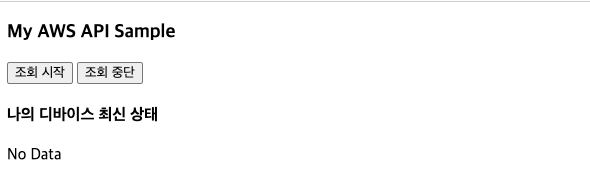
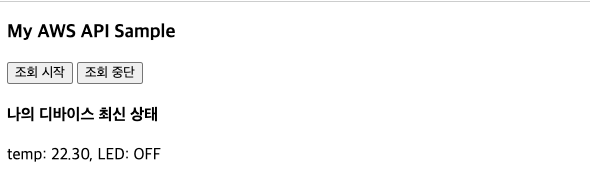

## 2. 디바이스 상태 조회 REST API 구축하기
다음과 같은 API 요청과 API 응답을 가지는 REST API를 Lambda 함수와 API Gateway를 이용하여 구축해본다.

- API 요청
	
	```	
	GET /devices/{deviceId}
	```
	
- 응답 모델
	- [GetThingShadow](https://docs.aws.amazon.com/ko_kr/iot/latest/developerguide/API_GetThingShadow.html)의 [응답 상태 문서](https://docs.aws.amazon.com/ko_kr/iot/latest/developerguide/device-shadow-document-syntax.html#device-shadow-example-response-json) 
		
		```json
		{
		    "state": {
		        "desired": {
		            "attribute1": integer2,
		            "attribute2": "string2",
		            ...
		            "attributeN": boolean2
		        },
		        "reported": {
		            "attribute1": integer1,
		            "attribute2": "string1",
		            ...
		            "attributeN": boolean1
		        },
		        "delta": {
		            "attribute3": integerX,
		            "attribute5": "stringY"
		        }
		    },
		    "metadata": {
		        "desired": {
		            "attribute1": {
		                "timestamp": timestamp
		            },
		            "attribute2": {
		                "timestamp": timestamp
		            },
		            ...
		            "attributeN": {
		                "timestamp": timestamp
		            }
		        },
		        "reported": {
		            "attribute1": {
		                "timestamp": timestamp
		            },
		            "attribute2": {
		                "timestamp": timestamp
		            },
		            ...
		            "attributeN": {
		                "timestamp": timestamp
		            }
		        }
		    },
		    "timestamp": timestamp,
		    "clientToken": "token",
		    "version": version
		}
		```

--
### 단계1: AWS Toolkit을 통해 Lambda 함수 생성
1. 다음 정보를 바탕으로 AWS Lambda 프로젝트를 JetBrains용 AWS Toolkit을 이용하여 생성한다.
	- **Project name**: *GetDeviceLambda*
	- **Rumtime**:*java11*
 	- **SDK**: 11버전의 SDK를 선택하거나 없으면 다운로드한 후 선택 
 	
	
2. 생성된 * GetDeviceLambda*의 **build.gradle** 파일을 열고, 다음 의존성을 추가하고, **변경사항을 반영**합니다.


	```
	dependencies {
        ...
        implementation platform('com.amazonaws:aws-java-sdk-bom:1.12.529')
        implementation 'com.amazonaws:aws-java-sdk-iot'
        ...
    }
   	```

3. **src/main/java/helloworld/App.java** 파일을 다음 코드로 바꿉니다.
	
	```java
	package helloworld;
	
	import com.amazonaws.services.iotdata.AWSIotData;
	import com.amazonaws.services.iotdata.AWSIotDataClientBuilder;
	import com.amazonaws.services.iotdata.model.GetThingShadowRequest;
	import com.amazonaws.services.lambda.runtime.Context;
	import com.amazonaws.services.lambda.runtime.RequestHandler;
	import com.amazonaws.services.lambda.runtime.events.APIGatewayProxyResponseEvent;
	
	import java.util.HashMap;
	import java.util.Map;
	
	/**
	 * Handler for requests to Lambda function.
	 */
	public class App implements RequestHandler<Event, APIGatewayProxyResponseEvent> {
	
	    public APIGatewayProxyResponseEvent handleRequest(final Event event, final Context context) {
	
	        AWSIotData iotData = AWSIotDataClientBuilder.standard().build();
	
	        GetThingShadowRequest getThingShadowRequest =
	                new GetThingShadowRequest()
	                        .withThingName(event.device);
	
	        String output = new String(
	                iotData.getThingShadow(getThingShadowRequest).getPayload().array());
	
	        Map<String, String> headers = new HashMap<>();
	        headers.put("Content-Type", "application/json");
	        headers.put("X-Custom-Header", "application/json");
	
	        APIGatewayProxyResponseEvent response = new APIGatewayProxyResponseEvent()
	                .withHeaders(headers)
	                .withStatusCode(200)
	                .withBody(output);
	        return response;
	    }
	}
	
	class Event {
	    public String device;
	}

	```
	
4. **src/test/java/helloworld/AppTest.java** 파일의 코드를 주석 처리한다.

--	
### 단계2: Lambda 함수의 로컬 테스트

작성된 Lambda함수가 정상적으로 동작하는 지를 테스트해 보기 위해서 다음 절차를 수행합니다.

- [**필수**] Docker 프로세스가 실행된 상태이어야 함 
  
1. IntelliJ IDEA IDE의 화면 상단 타이틀 바에서 "[Local] HelloWorldFunction" 옆의 **연두색 실행 버튼 (삼각형)을 클릭**
  
2. [**Edit Configuration**] 다이얼로그 화면에서 **Text -- Event Templates --** 부분의 드롭다운 메뉴 중에서 *API Gateway AWS Proxy*를 선택하고, 다음 입력 문자열을 입력한다.
	- 조회할 사물의 이름이 *MyMKRWiFi1010*인 경우를 가정

		```JSON
		{
			"device" : "MyMKRWiFi1010"
		}
		```

  
  - **Run** 클릭
    

3. **Console** 창에 다음과 같은 형식의 메시지가 마지막에 출력되는 지 확인합니다. (본인의 aws 계정에 생성된 사물의 상태가 Json 형식으로 반환됨)
   
   ```
   ...	
SSTART RequestId: e49a9f7e-bf5d-415a-b72d-9e5754830e79 Version: $LATEST
Picked up JAVA_TOOL_OPTIONS: -XX:+TieredCompilation -XX:TieredStopAtLevel=1
END RequestId: e49a9f7e-bf5d-415a-b72d-9e5754830e79
REPORT RequestId: e49a9f7e-bf5d-415a-b72d-9e5754830e79	Init Duration: 0.82 ms	Duration: 12795.96 ms	Billed Duration: 12796 ms	Memory Size: 512 MB	Max Memory Used: 512 MB	
{"statusCode": 200, "headers": {"X-Custom-Header": "application/json", "Content-Type": "application/json"}, "body": "{\"state\":{\"desired\":{\"welcome\":\"aws-iot\"},\"reported\":{\"temperature\":\"22.30\",\"LED\":\"OFF\",\"welcome\":\"aws-iot\"}},\"metadata\":{\"desired\":{\"welcome\":{\"timestamp\":1697592894}},\"reported\":{\"temperature\":{\"timestamp\":1697772333},\"LED\":{\"timestamp\":1697772333},\"welcome\":{\"timestamp\":1697592894}}},\"version\":1117,\"timestamp\":1699062480}"}
   
   ```
--	
### 단계3: Lambda 함수의 배포

- **GetDeviceLambda** 프로젝트 탐색창에서 **template.yaml**을 찾아서 선택하고, 선택된 상태에서 오른쪽 마우스 클릭하여 **SyncServerless Application (formerly Deploy)** 메뉴를 선택
  
  - [**Confirm development stack**] 다이얼로그 화면에서 **Confirm** 선택
  
  - [**SyncServerless Application (formerly Deploy)**] 다이얼로그 화면에서, **Create Stack**에 적절한 이름(예, *GetDeviceLambda*)을 입력 하고, S3 Bucket 중에 하나를 선택(S3 Bucket이 없으면 **Create** 버튼을 눌러 생성 후 선택)하고, **CloudFormation Capabilities:** 에서 **IAM** 체크박스를 선택한 후, **Sync** 클릭
    
    - [**참고**] 한참 동안 진행이 안되면 현재 스텝을 한번더 수행해 본다.  
  
  - 콘솔 창에 다음 결과가 맨 마지막 줄에 출력되는 지를 확인
    
    ```
    ...
	Stack creation succeeded. Sync infra completed.


	Process finished with exit code 0
    ``` 
--	
### 단계4: Lambda 함수의 원격 테스트
- AWS Lambda함수가 다른 AWS 서비스 (예, DynamoDB)를 사용하기 위해서는 필요한 권한이 Lambda함수에 연결된 **실행 역할 정책(Execution Role Polcity)**에  포함되어 있어야 합니다.
  
  - **실행 역할 정책 (Execution Role Polcity)**은 Lambda 함수가 실행되는 동안에만 사용되며, **AWS Identity and Access Management (IAM) 역할**과 연관됩니다. 가령, Lambda 함수가 IoT의 사물 목록을 조회할 권한이 필요한 경우, 실행 역할 정책은 **AWSIoTDataAcess** 권한을 가진 정책이 연결되어 있어야 합니다.
  
- **람다함수의 실행 역할 정책** 업데이트
  
  - **AWS Lambda 콘솔**에서 **함수** 페이지를 연다.
	- 나열된 함수 목록 중에서 *GetDeviceLambda-…* 함수를 선택한다.
	- **구성** 탭에서 **권한** 메뉴를 선택하면, **실행역할**을 찾을 수 있다.
  - **역할 이름**을 클릭하면, **권한 정책** 파트에서 해당 역할에 설정된 정책들을 확인할 수 있다.
  - 만약, 권한정책에 **AWSIoTFullAccess** 정책이 포함되어 있지 않다면, **권한 추가>>정책연결** 메뉴를 클릭하여 **AWSIoTFullAccess** 정책을 검색하고 선택한다음 **권한추가** 버튼을 클릭한다.
 - 원격 테스트를 위해서 **AWS Toolkit** 창의 탐색기에서  **Lambda**를 확장하여 *GetDeviceLambda-HelloWorldFunction-XXX*선택하고, 오른쪽 마우스 클릭하여 **Run '[Remote] HelloServer...'**메뉴를 선택
	- 로컬 테스트에서 사용했던 동일한 입력 값으로 테스트를 진행하고, 동일한 결과가 나오는지를 확인한다.
	
--	
### 단계5 API Gateway 콘솔에서 REST API 생성

1. [API Gateway 콘솔](https://ap-northeast-2.console.aws.amazon.com/apigateway/)로 이동합니다.
2. 이전에 생성한 *my-device-api*를 선택합니다.
3. 리소스 이름(**/devices**)을 선택한 후, **리소스 생성**을 클릭합니다.
10. **리소스** 이름에 *{device}*를 입력합니다. 
11. **리소스 경로(Resource Path)**는 */devices*를 선택합니다.
11. **리소스 생성**을 선택합니다.
12. **메서드** 섹션에서 **메소드 생성**을 클릭합니다.
13. **메서드 유형** 드롭다운 메뉴에서 **GET**을 선택합니다.
14. **통합 유형**에서 *Lambda 함수*를 선택합니다.
15. **Lambda 프록시 통합**은 선택안된 상태를 유지합니다.
15. **Lambda 함수**에서 Lambda 함수를 생성한 리전을 선택한 후 드롭다운 메뉴에서 *GetDeviceLambda-HelloWorldFunction*을 선택합니다.  **메서드 생성**을 클릭합니다.
16. **통합요청**을 선택하여, 클라이언트가 제공하는 HTTP Request를 Lambda 함수가 인식하는 형식으로 변환합니다.
	- 화면의 하단의 **템플릿 생성**을 클릭한다.
	- **콘텐츠 유형** 드롭다운 메뉴에서 *application/json*을 입력
	-  **탬플릿 생성** 드롭다운 메뉴에서 *메서드 요청 패스스루*를 선택하고, 템플릿 본문에 다음을 입력합니다.

		```
		{
		    "device": "$input.params('device')"
		}
		```
		
		이는 Lambda 함수에 전달될 payload를 구성하는 템플릿으로서, "device" 속성 값을 /{device} 경로변수의 값으로 사용하겠다는 의미입니다.
	- **탬플릿 생성**을 선택합니다.
21. **/devices/{device} – GET – 메소드 실행** 창으로 이동하여, **테스트** 탭을 클릭합니다.
22. device 경로에 본인이 만든 사물 이름(예, *MyMKRWiFi1010*)을 입력합니다. 
16. **테스트**를 클릭하고, 다음과 같은 결과가 나오는 지 확인합니다.
	
	```
	{"statusCode":200,
	 "headers":{"X-Custom-Header":"application/json","Content-Type":"application/json"},
	 "body":"{\"state\":{\"desired\":{\"welcome\":\"aws-iot\"},\"reported\":{\"temperature\":\"22.30\",\"LED\":\"OFF\",\"welcome\":\"aws-iot\"}},\"metadata\":{\"desired\":{\"welcome\":{\"timestamp\":1697592894}},\"reported\":{\"temperature\":{\"timestamp\":1697772333},\"LED\":{\"timestamp\":1697772333},\"welcome\":{\"timestamp\":1697592894}}},\"version\":1117,\"timestamp\":1699064142}"}
	...
	```
	
--
### 단계6: CORS 활성환 및 API Gateway 콘솔에서 REST API 배포


JavaScript는 **Cross-Origin Resource Sharing (CORS)** 요청을 기본적으로 제한합니다. 즉, JavaScript 코드가 동일 서버 내의 리소스를 접근하는 것은 허용하지만, 다른 서버의 리소스를 사용하고자 하는 경우에는 CORS 헤더 정보가 포함되어 있어야 합니다. 

- 더 자세한 정보는 https://developer.mozilla.org/ko/docs/Web/HTTP/Access_control_CORS 참조

**REST API 리소스에 대해 CORS 지원 활성화**

1. 리소스에서 **/devices**를 선택하고, **CORS 활성화**를 클릭합니다.
3. 게이트웨이 응답과 Access-Control-Allow-Methods의 모든 체크박스를 선택합니다.
4. **저장**를 선택합니다.


지금까지 API를 생성했지만 아직 실제로 사용할 수는 없습니다. 배포해야 하기 때문입니다.

1. 화면 상단의 **API베포** 버튼을 클릭합니다.
2. **배포 스테이지** 드롭다운 메뉴에서 이전에 생성한 *prod*를 선택합니다.
4. **배포**을 클릭합니다.
5. **URL 호출** 에 표시된 URL을 복사합니다.


--
### 단계7: REST API 테스트
1. **prod 스테이지 편집기**의 맨 위에 있는 **호출 URL**을 적어 둡니다.
2. 웹 브라우저 주소창에 *"호출 URL/devices/MyMKRWiFi1010"*을 입력한 후 엔터를 쳐 봅니다.
	- 이번 REST API는 GET 메소드만을 이용한 것이므로, 웹 브라우저에서도 테스트가 가능하지만, 일반적으로 API 테스트는 [cURL](https://curl.haxx.se/) 또는 [POSTMAN](https://www.getpostman.com/) 등의 도구를 사용합니다
	

3. 앞에서 정의한 응답모델과 동일한 형식의 JSon 문자열이 반환된 것을 확인할 수 있습니다.

### 단계8: REST API 활용한 JavaScript 기반 웹 프로그래밍
- **나의 디바이스 조회**
	- **get\_device\_state.html** 시작 html 페이지
	
		```html
		<!DOCTYPE html>
		<html lang="en">
		    <head>
		        <meta charset="UTF-8">
		        <title>AWS Open API Sample</title>
		
		        <!-- JQuery 라이브러리 설정 -->
		        <script src="https://code.jquery.com/jquery-3.4.1.min.js" integrity="sha256-CSXorXvZcTkaix6Yvo6HppcZGetbYMGWSFlBw8HfCJo=" crossorigin="anonymous"></script>
		
		        <!-- 디바이스 조회 자바스크립트 로딩-->
		        <script src="device_state.js"></script>
		    </head>
		    <body>
		        <h3>My AWS API Sample</h3>
		
		 
		        
		        <input type="button" value="조회 시작" onclick="Start();" />
		        <input type="button" value="조회 중지" onclick="Stop();" />
		        
		        <h4>나의 디바이스 최신 상태</h4>
		        
		        <div id="result">No Data</div>
		    </body>
		</html>
		```
	- **device_state.js**: JQuery 기반 Javascript 코드 

		```javascript
		// 중지를 위해 ID 보관
		var intervalId = null;
		
		// API 시작
		function Start() {
		    invokeAPI();
		    intervalId = setInterval(invokeAPI, 1000);
		    document.getElementById("result").innerHTML="조회 중...";
		}
		// API 중지
		
		function Stop() {
		    if(intervalId != null) {
		        clearInterval(intervalId);
		        document.getElementById("result").innerHTML="No Data";
		    }
		}
		
		var invokeAPI = function() {
		    // 디바이스 조회 URI
		    // prod 스테이지 편집기의 맨 위에 있는 "호출 URL/devices"로 대체해야 함
		    var API_URI = 'https://XXXXXXXXXX.execute-api.ap-northeast-2.amazonaws.com/prod/devices/MyMKRWiFi1010'; 		        
		    $.ajax(API_URI, {
		        method: 'GET',
		        contentType: "application/json",
		
		        success: function (data, status, xhr) {
		                var result = JSON.parse(data.body);
		                printData(result);  // 성공시, 데이터 출력을 위한 함수 호출
		               
		                console.log("data="+data);
		        },
		        error: function(xhr,status,e){
		                alert("error");
		        }
		    });
		};
		
		
		    
		// 데이터 출력을 위한 함수
		var printData = function(result){      
		    document.getElementById("result").innerHTML = "temp: "+ result.state.reported.temperature +  
		                                                ", LED: " + result.state.reported.LED;
		}
	```	
- **실행 화면**
	- 초기화면 

		

		
	- **조회** 버튼을 클릭한 후
	
		


