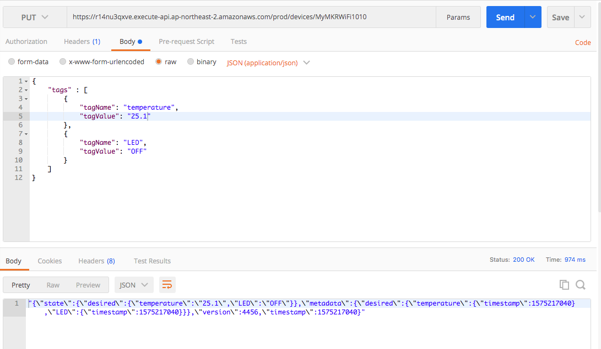

## 4. 디바이스 로그 조회 REST API 구축하기
다음과 같은 API 요청과 API 응답을 가지는 REST API를 Lambda 함수와 API Gateway를 이용하여 구축해본다.

	
- API 요청

	```		
	GET /devices/{deviceId}/log?from=1000&to=2000
	```	
- 응답모델
	
	```json
	{
		"data":[
			{
				"time":timestamp,
				"attributes": {
					"attribute1": integer3,
					"attribute2": "string3",
					...
				}
			},
			...
		]
	}
	```

--
### 단계1: AWS Toolkit을 통해 Lambda 함수 생성
- **사전준비 사항**
	- [DynamoDB를 이용한 백엔드 구축하기](https://kwanulee.github.io/DynamoDB/) 단원의 [4. DynamoDB와 AWS Lambda를 이용한 IoT Data 저장 백엔드 구축 실습 (수정)](https://kwanulee.github.io/DynamoDB/#4)의 실습이 완료된 상태여야 합니다.

1. 다음 정보를 바탕으로 AWS Lambda 프로젝트를 JetBrains용 AWS Toolkit을 이용하여 생성한다.
	- **Project name**: *LogDeviceLambda*
	- **Rumtime**:*java11*
 	- **SDK**: 11버전의 SDK를 선택하거나 없으면 다운로드한 후 선택 
 	
	
2. 생성된 * GetDeviceLambda*의 **build.gradle** 파일을 열고, 다음 의존성을 추가하고, **변경사항을 반영**합니다.


	```
	dependencies {
		...
       implementation platform('com.amazonaws:aws-java-sdk-bom:1.12.529')
       implementation 'com.amazonaws:aws-java-sdk-dynamodb'
       ...
   }
   ```

3. **src/main/java/helloworld/App.java** 파일을 다음 코드로 바꿉니다.
	
	```java
	package helloworld;
	
	import java.text.ParseException;
	import java.text.SimpleDateFormat;
	import java.util.HashMap;
	import java.util.Iterator;
	import java.util.Map;
	import java.util.TimeZone;
	
	
	import com.amazonaws.services.lambda.runtime.Context;
	import com.amazonaws.services.lambda.runtime.RequestHandler;
	import com.amazonaws.services.lambda.runtime.events.APIGatewayProxyResponseEvent;
	
	import com.amazonaws.services.dynamodbv2.AmazonDynamoDB;
	import com.amazonaws.services.dynamodbv2.AmazonDynamoDBClientBuilder;
	import com.amazonaws.services.dynamodbv2.document.DynamoDB;
	import com.amazonaws.services.dynamodbv2.document.Item;
	import com.amazonaws.services.dynamodbv2.document.ItemCollection;
	import com.amazonaws.services.dynamodbv2.document.QueryOutcome;
	import com.amazonaws.services.dynamodbv2.document.Table;
	import com.amazonaws.services.dynamodbv2.document.spec.QuerySpec;
	import com.amazonaws.services.dynamodbv2.document.utils.NameMap;
	import com.amazonaws.services.dynamodbv2.document.utils.ValueMap;
	
	/**
	 * Handler for requests to Lambda function.
	 */
	public class App implements RequestHandler<Event, APIGatewayProxyResponseEvent> {
	    private DynamoDB dynamoDb;
	    private String DYNAMODB_TABLE_NAME = "Logging";
	
	    public APIGatewayProxyResponseEvent handleRequest(final Event input, final Context context) {
	
	        this.initDynamoDbClient();
	        Table table = dynamoDb.getTable(DYNAMODB_TABLE_NAME);
	
	        long from=0;
	        long to=0;
	        try {
	            SimpleDateFormat sdf = new SimpleDateFormat ( "yyyy-MM-dd HH:mm:ss");
	            sdf.setTimeZone(TimeZone.getTimeZone("Asia/Seoul"));
	
	            from = sdf.parse(input.from).getTime() / 1000;
	            to = sdf.parse(input.to).getTime() / 1000;
	        } catch (ParseException e1) {
	            e1.printStackTrace();
	        }
	
	        QuerySpec querySpec = new QuerySpec()
	                .withKeyConditionExpression("deviceId = :v_id and #t between :from and :to")
	                .withNameMap(new NameMap().with("#t", "time"))
	                .withValueMap(new ValueMap().withString(":v_id",input.device).withNumber(":from", from).withNumber(":to", to));
	
	        ItemCollection<QueryOutcome> items=null;
	        try {
	            items = table.query(querySpec);
	        }
	        catch (Exception e) {
	            System.err.println("Unable to scan the table:");
	            System.err.println(e.getMessage());
	        }
	        String output = getResponse(items);
	
	        Map<String, String> headers = new HashMap<>();
	        headers.put("Content-Type", "application/json");
	        headers.put("X-Custom-Header", "application/json");
	
	        APIGatewayProxyResponseEvent response = new APIGatewayProxyResponseEvent()
	                .withHeaders(headers)
	                .withStatusCode(200)
	                .withBody(output);
	
	        return response;
	    }
	
	    private String getResponse(ItemCollection<QueryOutcome> items) {
	
	        Iterator<Item> iter = items.iterator();
	        String response = "{ \"data\": [";
	        for (int i =0; iter.hasNext(); i++) {
	            if (i!=0)
	                response +=",";
	            response += iter.next().toJSON();
	        }
	        response += "]}";
	        return response;
	    }
	
	    private void initDynamoDbClient() {
	        AmazonDynamoDB client = AmazonDynamoDBClientBuilder.standard().build();
	
	        this.dynamoDb = new DynamoDB(client);
	    }
	
	}
	
	class Event {
	    public String device;
	    public String from;
	    public String to;
	}
	```
	
4. **src/test/java/helloworld/AppTest.java** 파일의 코드를 주석 처리한다.

--	
### 단계2: Lambda 함수의 로컬 테스트

작성된 Lambda함수가 정상적으로 동작하는 지를 테스트해 보기 위해서 다음 절차를 수행합니다.

- [**필수**] Docker 프로세스가 실행된 상태이어야 함 
  
1. IntelliJ IDEA IDE의 화면 상단 타이틀 바에서 "[Local] HelloWorldFunction" 옆의 **연두색 실행 버튼 (삼각형)을 클릭**
  
2. [**Edit Configuration**] 다이얼로그 화면에서 **Text -- Event Templates --** 부분의 드롭다운 메뉴 중에서 *API Gateway AWS Proxy*를 선택하고, 다음 입력 문자열을 입력한다.
	- 조회할 사물의 이름이 *MyMKRWiFi1010*인 경우를 가정
	- device 속성: 변경할 사물의 이름
	- from 속성: 시작 시간 (yyyy-MM-dd hh:mm:ss) 형식의 문자열
	- to 속성: 종료 시간  (yyyy-MM-dd hh:mm:ss) 형식의 문자열

		```JSON
		{ "device": "MyMKRWiFi1010", "from":"2023-11-05 13:26:00", "to": "2023-11-05 13:28:00"}	
		```

  
  - **Run** 클릭
    

3. **Console** 창에 다음과 같은 형식의 메시지가 마지막에 출력되는 지 확인합니다. (본인의 aws 계정에 생성된 사물의 상태가 Json 형식으로 반환됨)
   
   ```
   ...
	Mounting /Users/kwanwoo/Dropbox/2023-2/IOTPlatform/aws-practice/LogDeviceLambda/.aws-sam/build/HelloWorldFunction as /var/task:ro,delegated, inside runtime container
	Picked up JAVA_TOOL_OPTIONS: -XX:+TieredCompilation -XX:TieredStopAtLevel=1
	END RequestId: 6b6e2735-2dd7-473b-91a7-a9a84d95b1de
	REPORT RequestId: 6b6e2735-2dd7-473b-91a7-a9a84d95b1de	Init Duration: 2.56 ms	Duration: 12914.47 ms	Billed Duration: 12915 ms	Memory Size: 512 MB	Max Memory Used: 512 MB	
	{"statusCode": 200, "headers": {"X-Custom-Header": "application/json", "Content-Type": "application/json"}, "body": "{ \"data\": [{\"temperature\":\"24.50\",\"LED\":\"OFF\",\"time\":1699158409,\"deviceId\":\"MyMKRWiFi1010\",\"timestamp\":\"2023-11-05 13:26:49\"},{\"temperature\":\"24.30\",\"LED\":\"OFF\",\"time\":1699158414,\"deviceId\":\"MyMKRWiFi1010\",\"timestamp\":\"2023-11-05 13:26:54\"},{\"temperature\":\"24.50\",\"LED\":\"OFF\",\"time\":1699158419,\"deviceId\":\"MyMKRWiFi1010\",\"timestamp\":\"2023-11-05 13:26:59\"},{\"temperature\":\"24.40\",\"LED\":\"OFF\",\"time\":1699158424,\"deviceId\":\"MyMKRWiFi1010\",\"timestamp\":\"2023-11-05 13:27:04\"},{\"temperature\":\"24.50\",\"LED\":\"OFF\",\"time\":1699158434,\"deviceId\":\"MyMKRWiFi1010\",\"timestamp\":\"2023-11-05 13:27:14\"},{\"temperature\":\"24.40\",\"LED\":\"OFF\",\"time\":1699158444,\"deviceId\":\"MyMKRWiFi1010\",\"timestamp\":\"2023-11-05 13:27:24\"},{\"temperature\":\"24.50\",\"LED\":\"OFF\",\"time\":1699158454,\"deviceId\":\"MyMKRWiFi1010\",\"timestamp\":\"2023-11-05 13:27:34\"},{\"temperature\":\"24.40\",\"LED\":\"OFF\",\"time\":1699158464,\"deviceId\":\"MyMKRWiFi1010\",\"timestamp\":\"2023-11-05 13:27:44\"},{\"temperature\":\"24.30\",\"LED\":\"OFF\",\"time\":1699158469,\"deviceId\":\"MyMKRWiFi1010\",\"timestamp\":\"2023-11-05 13:27:49\"},{\"temperature\":\"24.50\",\"LED\":\"OFF\",\"time\":1699158474,\"deviceId\":\"MyMKRWiFi1010\",\"timestamp\":\"2023-11-05 13:27:54\"}]}"}
   
   ```
--	
### 단계3: Lambda 함수의 배포

- **GetDeviceLambda** 프로젝트 탐색창에서 **template.yaml**을 찾아서 선택하고, 선택된 상태에서 오른쪽 마우스 클릭하여 **SyncServerless Application (formerly Deploy)** 메뉴를 선택
  
  - [**Confirm development stack**] 다이얼로그 화면에서 **Confirm** 선택
  
  - [**SyncServerless Application (formerly Deploy)**] 다이얼로그 화면에서, **Create Stack**에 적절한 이름(예, *LogDeviceLambda*)을 입력 하고, S3 Bucket 중에 하나를 선택(S3 Bucket이 없으면 **Create** 버튼을 눌러 생성 후 선택)하고, **CloudFormation Capabilities:** 에서 **IAM** 체크박스를 선택한 후, **Sync** 클릭
    
    - [**참고**] 한참 동안 진행이 안되면 현재 스텝을 한번더 수행해 본다.  
  
  - 콘솔 창에 다음 결과가 맨 마지막 줄에 출력되는 지를 확인
    
    ```
    ...
	Stack creation succeeded. Sync infra completed.


	Process finished with exit code 0
    ``` 
--	
### 단계4: Lambda 함수의 원격 테스트
- AWS Lambda함수가 다른 AWS 서비스 (예, DynamoDB)를 사용하기 위해서는 필요한 권한이 Lambda함수에 연결된 **실행 역할 정책(Execution Role Polcity)**에  포함되어 있어야 합니다.
  
  - **실행 역할 정책 (Execution Role Polcity)**은 Lambda 함수가 실행되는 동안에만 사용되며, **AWS Identity and Access Management (IAM) 역할**과 연관됩니다. 가령, Lambda 함수가 IoT의 사물 목록을 조회할 권한이 필요한 경우, 실행 역할 정책은 **AmazonDynamoDBFullAccess** 권한을 가진 정책이 연결되어 있어야 합니다.
  
- **람다함수의 실행 역할 정책** 업데이트
  
  - **AWS Lambda 콘솔**에서 **함수** 페이지를 연다.
	- 나열된 함수 목록 중에서 *LogDeviceLambda-…* 함수를 선택한다.
	- **구성** 탭에서 **권한** 메뉴를 선택하면, **실행역할**을 찾을 수 있다.
  - **역할 이름**을 클릭하면, **권한 정책** 파트에서 해당 역할에 설정된 정책들을 확인할 수 있다.
  - 만약, 권한정책에 **AmazonDynamoDBFullAccess** 정책이 포함되어 있지 않다면, **권한 추가>>정책연결** 메뉴를 클릭하여 **AmazonDynamoDBFullAccess** 정책을 검색하고 선택한다음 **권한추가** 버튼을 클릭한다.
 - 원격 테스트를 위해서 **AWS Toolkit** 창의 탐색기에서  **Lambda**를 확장하여 *LogDeviceLambda-HelloWorldFunction-XXX*선택하고, 오른쪽 마우스 클릭하여 **Run '[Remote] HelloServer...'**메뉴를 선택
	- 로컬 테스트에서 사용했던 동일한 입력 값으로 테스트를 진행하고, 동일한 결과가 나오는지를 확인한다.
	
--	
### 단계5 API Gateway 콘솔에서 REST API 생성

1. [API Gateway 콘솔](https://ap-northeast-2.console.aws.amazon.com/apigateway/)로 이동합니다.
2.이전에 생성한 *my-device-api*를 선택합니다.
3. 리소스 이름(**/{device}**)을 선택하고, **리소스 생성**을 선택합니다.
4. **리소스 이름**에 *log*를 입력하고, **리소스 생성**을 클릭합니다.
4. **메서드** 섹션에서 **메소드 생성**을 클릭합니다.
5. **메서드 유형** 드롭다운 메뉴에서 **GET**을 선택합니다.
6. **통합 유형**에서 *Lambda 함수*를 선택합니다.
7. **Lambda 함수**에서 Lambda 함수를 생성한 리전을 선택한 후 드롭다운 메뉴에서 *LogDeviceLambda-HelloWorldFunction*을 선택합니다.  **메서드 생성**을 클릭합니다.

다음 단계는 API Gateway를 통해 들어오는 클라이언트의 입력을 Lambda 함수에 전달하기 위해서 클라이언트의 입력을 Lambda 함수의 입력으로 매핑하는 과정에 대해서 진행합니다.
	
1. **메서드 실행** 창에서 **메서드 요청**을 선택합니다.
2. **URL 쿼리 문자열 파라미터(URL Query String Parameters)** 섹션을 확장합니다. 
	- **쿼리 문자열 추가(Add query string)**를 선택합니다. 이름에 *from*을 입력합니다. 필수 옵션을 선택하고 확인 표시 아이콘을 선택하여 설정을 저장합니다. 캐싱(Caching)을 비워두어 이 연습에 불필요한 요금 부과를 방지합니다.	
	- **쿼리 문자열 추가(Add query string)**를 선택합니다. 이름에 *to*을 입력하고, 이전과 동일한 과정을 진행합니다.
	
6. /log GET 메서드를 선택하고 **통합 요청(Integration Request)**을 선택하여 본문 매핑 템플릿을 설정합니다.
	- 화면의 하단의 **템플릿 생성**을 클릭한다.
	- **콘텐츠 유형** 드롭다운 메뉴에서 *application/json*을 입력
	-  **탬플릿 생성** 드롭다운 메뉴에서 *UpdateDeviceInput*을 선택하고, 템플릿 본문에 다음을 입력합니다.

		```json
		{
		  "device": "$input.params('device')",
		  "from": "$input.params('from')",
		  "to":  "$input.params('to')"
		}
		```	
		
	- **탬플릿 생성**을 선택합니다.
21. **/devices/{device}/log – GET – 메소드 실행** 창으로 이동하여, **테스트** 탭을 클릭합니다.
22. device 경로에 본인이 만든 사물 이름(예, *MyMKRWiFi1010*)을 입력합니다. 
7. **쿼리 문자열**에 아래와 같은 내용을 입력합니다.

	```
	from="2023-11-05 13:26:00"&to="2023-11-05 13:27:00"
	```

16. **테스트**를 클릭하고, 다음과 같은 결과가 나오는 지 확인합니다.
	
	```
	업데이트
	...
	```
	
--
### 단계6: CORS 활성환 및 API Gateway 콘솔에서 REST API 배포


JavaScript는 **Cross-Origin Resource Sharing (CORS)** 요청을 기본적으로 제한합니다. 즉, JavaScript 코드가 동일 서버 내의 리소스를 접근하는 것은 허용하지만, 다른 서버의 리소스를 사용하고자 하는 경우에는 CORS 헤더 정보가 포함되어 있어야 합니다. 

- 더 자세한 정보는 https://developer.mozilla.org/ko/docs/Web/HTTP/Access_control_CORS 참조

**REST API 리소스에 대해 CORS 지원 활성화**

1. 리소스에서 **/devices/{device}/log**를 선택하고, **CORS 활성화**를 클릭합니다.
3. 게이트웨이 응답과 Access-Control-Allow-Methods의 모든 체크박스를 선택합니다.
4. **저장**를 선택합니다.


지금까지 API를 생성했지만 아직 실제로 사용할 수는 없습니다. 배포해야 하기 때문입니다.

1. 화면 상단의 **API베포** 버튼을 클릭합니다.
2. **배포 스테이지** 드롭다운 메뉴에서 이전에 생성한 *prod*를 선택합니다.
4. **배포**을 클릭합니다.
5. **URL 호출** 에 표시된 URL을 복사합니다.


--
### 단계7: REST API 테스트
1. **prod 스테이지 편집기**의 맨 위에 있는 **호출URL**을 적어 둡니다.
2. [POSTMAN](https://www.getpostman.com/) 등의 도구를 사용하여 테스트 해 봅니다.
	- 사용절차
		1. 포스트맨 회원가입 후 로그인
		2. **Workspaces** > **My Workspace** 선택
		3. **+** 버튼을 눌러 새로운 요청 생성
			1. 요청 메소드로 **GET** 선택
			2. URL 입력창에 다음과 같은 URL을 입력
				- 가정: DynamoDB의 logging 테

			```
			https://g10uszb351.execute-api.ap-northeast-2.amazonaws.com/test/MyMKRWiFI1010/log?from=2023-10-26%2012:24:00&to=2023-10-26%2012:26:00
			```

			4. **Send** 버튼을 클릭한다.
			
	
	

3. 앞에서 정의한 응답모델과 동일한 형식의 JSon 문자열이 반환된 것을 확인할 수 있습니다.
